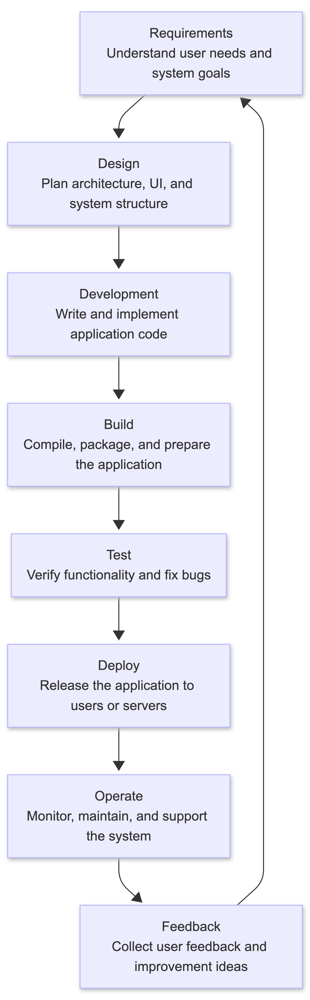

# Project Documentation

## 1. SDLC Flowchart



## 2. Manual Docker Build & Run Workflow


## 3. Manual Docker Script Flow


## 4. Docker Compose Multi-Service Workflow


---

## 5. Lesson Notes

You can either **embed the content** or **link to nodes.md**:

[View LESSON Notes](NOTES.md)

---

## 6. Docker Cheatsheet

[View Docker Sheets](DOCKER_CHEATSHEET.md)

---

## 7. How to Run Locally

```bash
git clone https://github.com/rubenhtun/devops-odyssey.git
cd devops-odyssey/01-sdlc-and-docker
chmod +x deploy.sh
./deploy.sh
# or
bash deploy.sh
```
