# Project Documentation

## Overview

This is a practical DevOps learning lab demonstrating SDLC (Software Development Life Cycle)
principles implemented through Docker containerization. The hands-on session provides working examples of manual Docker workflows, automated scripting, and multi-service orchestration using Docker Compose.

## Prerequisites

- Docker & Docker Compose installed to running on local machine or server.
- Git for version control and managing source code.
- Basic Linux Knowledge, familiarity with terminal commands.

---

## 1. SDLC Flowchart



## 2. Manual Docker Build & Run Workflow



## 3. Manual Docker Script Flow



## 4. Docker Compose Multi-Service Workflow



---

## 5. Lab Notes

[View Lab Notes](NOTES.md)

---

## 6. Docker Cheatsheet

[View Docker Sheets](DOCKER_CHEATSHEET.md)

---

## 7. How to Run Locally

```bash
git clone https://github.com/rubenhtun/devops-odyssey.git
```

```bash
cd devops-odyssey/01-sdlc-and-docker
```

```bash
chmod +x deploy.sh
```

```bash
./deploy.sh
```

### or

```bash

bash deploy.sh
```
