# Lab Documentation

## Overview

Alright, so here's the thing. If we reflect back in Lab 01, we learned how to build containers manually, which is cool, isn't it? But imagine doing that every single time you push code to production that would be a nightmare, right? I think so.

This is why Git and CI/CD concepts come into play. I rather say that Git is actually our **source control team manager** who can track of every single change we make to our codebase. So, how about CI/CD? It's like an **automated assembly line** that takes all our code changes and regularly builds, tests, and deploys them without us having to manually type commands over and over again.

In this lab, we're learning how Git and CI/CD work conceptually with just flow diagrams, not abosolute practically because I just added some additional lines of Docker Compose and commands. However, we should know in advance CI/CD orchestrates this beautiful automation before jumping into upcoming labs. From the moment you `git push` new code changes, a pipeline awakens himself impulsively: it fetches your changes, builds a Docker container, runs tests, and deploys it to your environment. No manual intervention needed anymore.

## Prerequisites

- Docker and Docker Compose installed and running
- Git installed and configured on your machine
- Basic understanding of version control concepts
- Flask Python application with environment variable support
- Docker Compose setup with service orchestration

---

## 1. Pipeline Architecture Overview

So what does a typical CI/CD pipeline actually look like? Personally, I was totally confused when I heard the term "CI/CD" for the first time. So for any reader who feels the same way, let me break it down here.

No matter what you push to the Git repository, whether it's spaghetti code or refactored code, the pipeline workflow automatically knows that it's time to start again. Simply, think of it like a chain of security checkpoints along a highway in Burma. Only when succeeded at one checkpoint, you are allowed to move forward to the next destination. Right?

The CI/CD pipeline also detects your pushed code first, then pulls the latest updated code and builds a Docker image from it. After that, it will execute any automated tests, and if everything passes, we will reach the deployment stage for production. So, the main thing is each step depends on the previous one succeeding, kind of like a domino effect. If anything breaks at any point, the whole pipeline stops and alerts you the failure because broken code and unstable systems should never be allowed to reach end users.



---

## 2. CI/CD Docker Application Flow

Let's keep diving into the CI/CD pipeline aspects when Docker is actually involved.

Similar to the above overall illustration, when our codebase gets committed and pushed, the CI/CD system enters action. It doesn't use a pre-built image. Instead, it builds a fresh Docker image from your specified Dockerfile using the latest code each time.

This is so important as it ensures the container always has the newest version of the application. After assembling with all needed stuff, the system starts a container from this new image in the target environment in order to be accessible by users.

But the ongoing process is still there to monitoring any health checks of the app. And if everything looks good, the container will be allowed to keep running while stopping the old one. This way makes your app always be up to date without any manual effort.

It's like having an active robot that watches your code repository 24/7 on time and automatically deploys new updates as early as possible after the moment you push new changes!!!


---

## 3. Lab Notes

[View Lab Notes](NOTES.md)

---

## 4. Docker Cheatsheet

[View Docker Cheatsheet](DOCKER_CHEATSHEET.md)

---

## 5. How to Run Locally

```bash
git clone https://github.com/rubenhtun/devops-odyssey.git
```

```bash
cd devops-odyssey/02-git-and-cicd-concepts
```

```bash
docker-compose up -d
```

```bash
docker ps
```
