# Lesson 02: Git & CI/CD Concepts

## CI/CD Pipeline System Architecture

### 1. Source Stage (Version Control)

- **Technical Breakdown:** Developers push **code changes** to a remote repository (GitHub) by creating **commits**.
- **Key Concept:** This stage manages different **branches** (Feature, Develop, Main), allowing teams to work on multiple features simultaneously for even a small application.

### 2. Build Stage (Continuous Integration)

- **Technical Breakdown:** **Jenkins**, acting as the **Automation Orchestrator**, pulls the source code and builds a **Docker Image**.
- **Key Concept:** This creates a **portable artifact** that ensures consistency across different environments, effectively solving the "it works on my machine" problem caused by mismatched dependencies.

### 3. Test Stage (Continuous Inspection)

- **Technical Breakdown:** **Automated Unit Tests** are executed to verify the code logic.
- **Key Concept:** Tools like **SonarQube** perform **Static Code Analysis** to identify bugs, security vulnerabilities, code smells, and hotspots, ensuring high **code quality** before moving forward.

### 4. Publish Stage (Artifact Management)

- **Technical Breakdown:** Successfully built and tested Docker images are pushed to an **Artifact Repository** or **Container Registry**.
- **Key Concept:** Popular choices include **Docker Hub**, **Nexus**, or **JFrog Artifactory**. This stage ensures that only "proven" images are stored for deployment.

### 5. Staging Stage (Pre-production Environment)

- **Technical Breakdown:** Before reaching end-users, the application is deployed to a **Staging Environment** (or QA Environment) that mirrors the production setup.
- **Key Concept:** This stage is used for **User Acceptance Testing (UAT)** and final Quality Assurance (QA) to ensure everything runs correctly on a live server.

### 6. Production Stage (Continuous Deployment/Delivery)

- **Technical Breakdown:** The final, **robust** application is deployed to the **Production Environment** for end-user access.
- **Key Concept:** Depending on the strategy (e.g., Blue-Green or Rolling Update), this stage delivers the value to the customers with high availability and minimal downtime.
