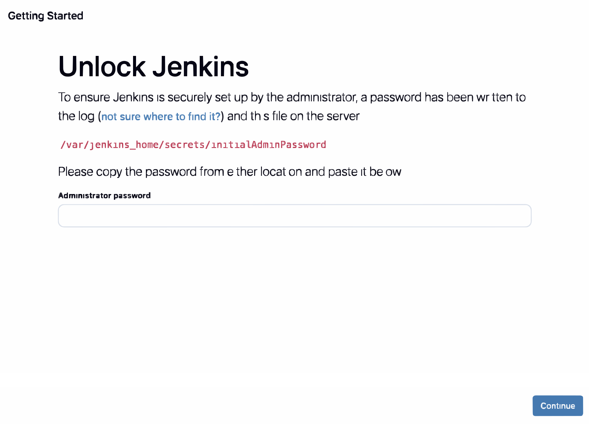

# Jenkins Automation Lab

### 1. Environment Setup

`Jenkins` server ကို manually setup လုပ်စရာမလိုအောင် ကြိုရေးထားသင့်သမျှကို `docker-compose` ဖိုင်မှာ `Infrastructure as Code (IaC)` ပုံစံနဲ့ ရေးခဲ့ပါတယ်။

- **File:** `docker-compose.yml`
- **Key Configurations:**

  - Jenkins နောက်ဆုံး version ကို သုံးထားပါတယ်။

  - Container နာမည်ကိုလည်း `jenkins-server` လို့ ပေးထားပါတယ်။

  - တခြား permission တွေ ပြဿနာတက်တာမျိုး မဖြစ်ရအောင်ဆိုပြီး `privileged: true` အပြင် `root user` ပေးထားပါတယ်။

  - Port 8080 ကို ဖွင့်ထားတာက local host မှာ Jenkins Dashboard ကို တန်းကြည့်လို့ရအောင်ပါ။

  - `./jenkins_home` ကျရင်တော့ Jenkins ဟာ restart ဖြစ်သွားရင်တောင် သူနဲ့ဆိုင်တဲ့ ဒေတာတွေကို မပျောက်သွားရအောင် `Volume Mount` လုပ်ပေးထားတဲ့ သဘောပါ။

  - နောက်ပြီး Jenkins container အတွင်းကနေ ကိုယ့်ကွန်ပျူတာမှာ သွင်းထားတဲ့ `Docker Engine` ကို ထိန်းချုပ်ဖို့ လိုလာမှာ ဖြစ်တဲ့အတွက် `/var/run/docker.sock` ကို တွဲချိတ်ထားတာဖြစ်ပါတယ်။

### 2. Launching the Container

`docker-compose.yml` ဖိုင်မှာ အကုန်လုံး သေချာသွားပြီဆိုရင် container ကို စမောင်းလို့ ရပါပြီ။

```bash
docker-compose up -d
```

ဒီနေရာမှာ Jenkins ကနေ လိုအပ်တဲ့ဟာမှန်သမျှကို အကုန် pull လုပ်ပြီးသွားဖို့ အချိန်နည်းနည်း စောင့်ရမှာ ဖြစ်ပါတယ်။ အဲ့တာပြီးသွားရင် `03-jenkins-automation` directory ထဲမှာ `jenkins_home` folder တက်လာမှာ ဖြစ်ပါတယ်။

### 3. Unlocking Jenkins

ဆက်လုပ်ရမှာက Jenkins Dashboard `http://localhost:8080` ကို ဝင်ပြီး admin password တွေအတွက် setup လုပ်စရာရှိတာ လုပ်ပေးသွားရမှာဖြစ်ပါတယ်။ Password ကို ယူဖို့အတွက် နည်းနှစ်မျိုးနဲ့ လုပ်လို့ရပါတယ်။

```bash
# ပထမအနေနဲ့ လက်ရှိ run နေတဲ့ Jenkins container ကို ကြည့်ရမှာပါ။
docker ps
```

```bash
# logs ကို ဖတ်ပြီး 32-character password ကို ရှာယူတာပါ။
docker logs jenkins-server
```

### or

```bash
# logs ထဲမှာ မရှာချင်ရင်တော့ ဖိုင်ထဲကနေ တိုက်ရိုက်သွားဖတ်ပါ။
docker exec jenkins-server cat /var/jenkins_home/secrets/initialAdminPassword
```

### 4. Initial Configuration



ရလာတဲ့ password ကိုသုံးပြီး `Unlock` လုပ်ပြီးရင် ကျန်တာက `Install suggested plugins` ကို ရွေးပြီး `Git` နဲ့ `Pipeline` အတွက် လိုအပ်တဲ့ `plugins` တွေကို ဆက်ထည့်သွားဖို့ လိုပါတယ်။


ဒီအထိ ပြီးပြီးဆိုရင် Jenkins Server တစ်ခုကို အောင်အောင်မြင်မြင်နဲ့ setup လုပ်နိုင်ခဲ့ပါပြီ။

### 5. Installing Docker CLI inside Jenkins

တကယ်တော့ Jenkins container ဟာ `Docker Engine` နဲ့ ချိတ်ဆက်ထားတာ မှန်ပေမယ့်လို့ သူ့အထဲမှာ `Docker CLI` ရှိမနေသေးဘူးဆိုရင် အောက်က command သုံးကြောင်းကို အစဉ်လိုက် ရိုက်ထည့်သွားရုံပါပဲ။ ဒီ command တွေ ကြိုမထည့်ခဲ့ဘူးဆိုရင် Jenkins dashboard မှာ Freestyle project တစ်ခု build လုပ်စဉ်အတွင််းမှာပဲ `docker: not found` ဆိုတဲ့ error ကြုံကောင်းကြုံလာမှာ ဖြစ်ပါတယ်။

```bash
docker exec -it -u root jenkins-server bash
```

```bash
apt-get update && apt-get install -y docker.io
```

```bash
docker --version
```
