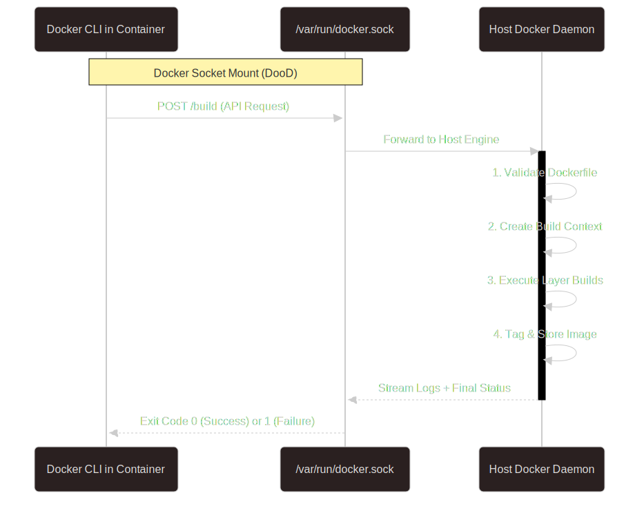

# Project Documentation

## Overview

This project demonstrates setting up a Jenkins CI/CD pipeline using Docker containers with Docker-out-of-Docker (DooD) architecture.

## Prerequisites

- Docker and Docker Compose installed
- Git installed
- Basic understanding of CI/CD concepts

---

## 1. Jenkins Infrastructure Setup

Through the infrastructure diagram below, we can understand how the Jenkins container communicates with our host OS.



## 2. Docker-out-of-Docker (DooD) Sequence

From within the Jenkins container, the Docker CLI sends API requests to the host's Docker daemon via a mounted socket.



## 3. Freestyle Job Workflow

This diagram illustrates the continuous integration (CI) process on Jenkins, which pulls code from GitHub and ultimately builds a Docker image.


## 4. CI/CD Pipeline Roadmap


---

## 5. Lesson Notes

[View Lesson Notes](NOTES.md)

---

## 6. Jenkins Lab Cheatsheet

[View Jenkins Lab Sheets](JENKINS_LAB.md)

---

## 7. How to Run Locally

### Step 1: Create Freestyle Project

- Click **New Item**
- Enter name and select **Freestyle project**
- Click **OK**

### Step 2: Configure SCM (Git)

- Go to **Source Code Management**
- Select **Git**
- Paste **Repository URL**
- Set **Branch Specifier** to `*/main`

### Step 3: Configure Build Steps

- Go to **Build Steps** > **Add build step** > **Execute shell**
- Input the following:

```bash
echo "--- Current Directory ---"
pwd
echo "--- Files in Workspace ---"
ls -la
echo "--- Testing Docker Access ---"
docker --version
```

### Step 4: Execute Build

- Click **Save**
- Click **Build Now**
- Check **Console Output** to verify the results.

---

## 8. Extra Tips

- **Automated Builds:** To enable automatic builds, check the **Poll SCM** option in the build trigger section.
- **Polling Schedule:** Add `* * * * *` in the **Schedule** field to instruct Jenkins to check GitHub every minute.
- **Effect:** This ensures Jenkins automatically detects new commits, keeping the workspace and pipeline synchronized with the latest code changes.
