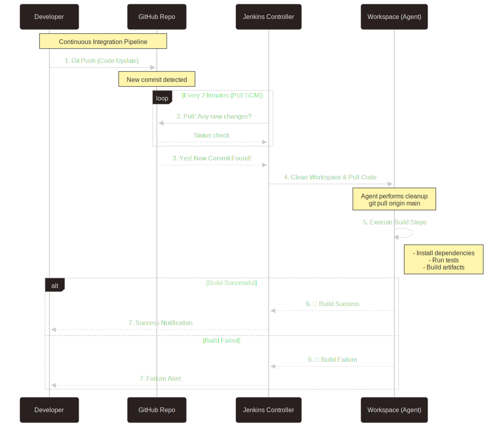
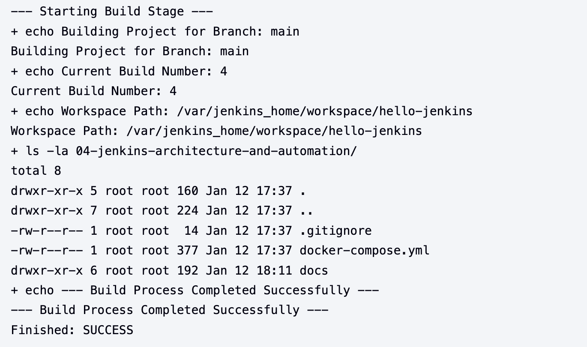

# Project Documentation

## Overview

This project demonstrates advanced Jenkins automation setup, focusing on CI/CD pipeline implementation using parameters, automation triggers, and Git integration.

## Prerequisites

- Docker and Docker Compose installed (as per Lab 3).
- Git installed with essential branches: `feature`, `develop`, and `main`.
- Basic understanding of CI/CD concepts.

---

## 1. Jenkins Home Structure

Even though Jenkins runs inside a Docker container, it relies heavily on its internal file system to keep everything organized. Think of the `/var/jenkins_home` directory as the foundation; folders like `config` and `jobs` aren't just storage spaces—they are essential components that maintain the server's settings and keep track of every project's history.


## 2. Automation Workflow

The magic of automation starts the moment a developer pushes code to a repository like GitHub. This action alerts the Jenkins server that something has changed. From there, the Jenkins Controller takes over, guiding its workspace agents to pull the latest code and transform it into a finished product, or "artifact," without any manual intervention.



## 3. Distributed Architecture

We can think of the Distributed Architecture as a "Brain and Hands" setup. The Jenkins Controller acts as the brain—handling the logic, scheduling, and management while the Agent Nodes act as the hands. These agents do the heavy lifting, like running shell scripts, building Docker images, and executing tests. This division of labor ensures that the system stays fast and efficient, even when handling multiple tasks at once.



---

## 4. Lab Notes

[View Lab Notes](NOTES.md)

---

## 5. Jenkins Lab Cheatsheet

[View Jenkins Lab Sheets](JENKINS_LAB.md)

---

## 6. How to Setup a New Freestyle Project

### Step 1: Create Freestyle Project

1. Click **New Item** on the Jenkins Dashboard.
2. Enter a project name and select **Freestyle project**.
3. Click **OK** to proceed to the configuration page.

### Step 2: Configure Parameters

1. Check the box **This project is parameterized**.
2. Click **Add Parameter** and select **String Parameter**.

- **Name:** `BRANCH_NAME`
- **Default Value:** `main`
- **Description:** Write anything related to the branch.

### Step 3: Source Code Management (SCM)

1. In the **Git** section, enter **Repository URL**.
2. Under **Branch Specifier**, use the parameter created above: `*/${BRANCH_NAME}`.

### Step 4: Build Triggers

1. Select **Poll SCM**.
2. Enter the schedule `H/2 * * * *` for every 2 minutes to check for code updates automatically.

### Step 5: Build Steps

1. Click **Add build step** and select **Execute shell**.
2. Because we are not using a `Dockerfile` in this lab, we will use this `Execute shell` script for testing purpose.

```bash
echo "--- Starting Build Stage ---"
echo "Building Project for Branch: ${BRANCH_NAME}"
echo "Current Build Number: ${BUILD_NUMBER}"
echo "Workspace Path: ${WORKSPACE}"

# List contents of the project folder
ls -la 04-jenkins-architecture-and-automation/

echo "--- Build Process Completed Successfully ---"
```

---

Finally, we will see this kind of console output.


