# Project Documentation

## Overview

This lab demonstrates how to make Jenkins automatically build Docker images, tag them with version numbers, push them to Docker Hub, and deploy the containers. Everything is done through shell scripts in Jenkins.

## Prerequisites

- Docker installed and running
- Docker Hub account for pushing images
- Jenkins setup and running
- Git with basic branching (feature, develop, main)
- Basic idea of what CI/CD pipelines do

---

## 1. CI/CD Docker Push Flow

Think of GitHub as the blueprint office where your app plans are kept. Jenkins is the foreman who checks for updated blueprints every few minutes. When he finds new ones, his construction crew (the pipeline stages) builds a Docker "house" from those plans, tests it's solid, then stores it in the Docker Hub warehouse. Finally, the production neighborhood fetches the latest house and opens it for visitors at port 5000. Every code update triggers this whole automatic rebuild-and-replace cycle!



---

## 2. Jenkins DooD Flow

We can imagine our computer as a big house, and Docker is the main workshop inside that house where all the building happens. Jenkins is like a little manager who lives in a small guest room (the Jenkins container) inside that house.

But Jenkins doesn't have tools to build things himself! So we give him a walkie-talkie—that's the docker.sock file we mount. Whenever Jenkins needs to build something for example, when we push code, he uses the walkie-talkie to call the main workshop's foreman (the Docker Daemon): "Hey, build me a Python app with these instructions!"

The foreman says: "Of course, my boy!" Then he creates temporary workbenches (build containers) in the main workshop, builds the thing, and replies back: "Here's your built app, Jenkins!" Jenkins then says: "Thank you, sir! Now push it to the storage shelf (Docker Hub) and put it to work (deploy)!"



---

## 3. Docker Tagging Strategy

Think of Git commits as evolutionary steps—each one refines the code and gets a version number. Docker simply takes the latest commit, builds an image from it, tags it with that version, and pushes it to the registry.



---

## 4. Lab Notes

[View Lab Notes](NOTES.md)

---

## 5. Jenkins Lab Cheatsheet

[View Jenkins Lab Sheets](JENKINS_LAB.md)

---

## 6. How to Setup a New Freestyle Project Using Credentials

### Step 1: Create a Freestyle Project

1. Go to your **Jenkins Dashboard** and click **New Item**.
2. Enter the project name: `odyssey-app`.
3. Select **Freestyle project** and click **OK**.

### Step 2: Build Environment (Secure Credentials)

Unlike previous labs, Day 5 requires secure authentication to push images to Docker Hub.

1. Scroll down to the **Build Environment** section.
2. Check the box **Use secret text(s) or file(s)**.
3. Under **Bindings**, click **Add** and select **Username and Password (separated)**.

- **Username Variable:** `DOCKER_USERNAME`
- **Password Variable:** `DOCKER_PASSWORD`
- **Credentials:** Select the `docker-hub-creds` you can create in Jenkins Credentials settings.

### Step 3: Source Code Management

1. In the **Git** section, enter your **Repository URL**: `https://github.com/<GITHUB_USERNAME>/devops-odyssey.git`.
2. Set the **Branch Specifier** to `*/main`.

### Step 5: Build Steps (Execute Shell)

This is the core of the automation. We move from simple commands to a full Docker lifecycle.

```bash
# Navigate to the specific Lab folder
cd 05-jenkins-docker-push

# Build the Docker Image with a unique Build Number
docker build -t <DOCKER_HUB_USERNAME>/<app-name>:${BUILD_NUMBER} .

# Tag the image as 'latest' for production use
docker tag <DOCKER_HUB_USERNAME>/<app-name>:${BUILD_NUMBER} <DOCKER_HUB_USERNAME>/<app-name>:latest

# Login to Docker Hub using Non-Interactive Mode
echo $DOCKER_PASSWORD | docker login -u $DOCKER_USERNAME --password-stdin

# Push both Versioned and Latest images to the Registry
docker push <DOCKER_HUB_USERNAME>/<app-name>:${BUILD_NUMBER}
docker push <DOCKER_HUB_USERNAME>/<app-name>:latest

# Cleanup old containers and run the new version
docker rm -f <container-name> || true
docker run -d --name <container-name> -p 5000:5000 <DOCKER_HUB_USERNAME>/<app-name>:latest
```
