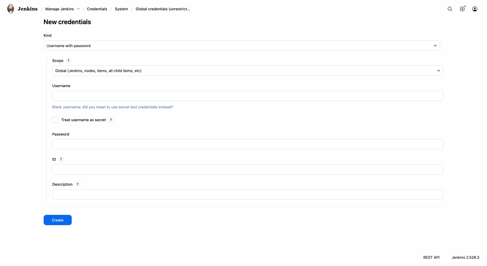

# Jenkins Pipeline as Code (Declarative)

ဒီ Lab 6 ရဲ့ အဓိက ရည်ရွယ်ချက်ကတော့ အရင် Lab 5 မှာ manual လုပ်ခဲ့တဲ့ process တွေကို **Jenkinsfile** တစ်ခုထဲမှာ စုစည်းပြီး **Automation** လိုမျိုး အဆင့်မြှင့်တင်ထားတာ ဖြစ်ပါတယ််။ DevOps သဘောသဘာဝအရ ပိုရိုးရှင်းသွားတဲ့ သဘောပါ။ ဆိုလိုတာက manual လုပ်တုန်းကဆို **Jenkins Dashboard** ထဲမှာ ဟိုနားတစ်ကွက် ဒီနားတစ်ကွက် လိုက်ပြင်နေရတာပါ။ အခုတော့ `Jenkinsfile` တစ်ခုတည်းကို ကြည့်လိုက်တာနဲ့ step တွေအားလုံးကို သိနိုင်တာပါ။ အဲ့ကြောင့် **GitHub repo** ထဲမှာ `Jenkinsfile` ကိုပါ တစ်ပါတည်းထည့်ပြီး Jenkins က အဲဒီ blueprint အတိုင်း **Cleanup, Checkout, Build, Push,** နဲ့ **Deploy** အဆင့်တွေကို အစဉ်လိုက် အလိုအလျောက် လုပ်ဆောင်သွားမှာ ဖြစ်ပါတယ်။ Build လုပ်တိုင်းမှာ build number နဲ့ image version တွေကို ခွဲခြားပေးသွားမှာဖြစ်ပြီး နောက်ဆုံး version ကို **localhost:5000** မှာ deploy လုပ်ပေးမှာ ဖြစ်ပါတယ်။

---

### 1. Credentials Configuration

ပထမဆုံးအနေနဲ့ **Docker Hub** ဆီကို image တွေ secure ဖြစ်ဖြစ် လှမ်းပို့ဖို့အတွက် credentials ကို Jenkins Credentials Store ထဲမှာ အရင်သိမ်းထားရပါမယ်။



- **Jenkins credentials:**
- **Kind:** Username with password
- **Username:** `rubenhtun`
- **Password:** `********` (ဒီနေရာမှာ Docker Hub Access Token သုံလည်း ရပါတယ်)
- **ID:** `docker-hub-creds` (ဒီ ID ကို Jenkinsfile ထဲမှာ ပြန်ခေါ်သုံးမှာပါ)

---

### 2. Pipeline Definition (SCM)

အပေါ်မှာ ပြောခဲ့သလို Jenkins project ထဲမှာ commands တွေကို တိုက်ရိုက်မရေးတော့ဘဲ **GitHub** ပေါ်က `Jenkinsfile` ကို ဖတ်ခိုင်းမှာ ဖြစ်ပါတယ်။

- **Project Type:** Pipeline
- **Definition:** Pipeline script from SCM
- **SCM:** Git
- **Repository URL:** `https://github.com/rubenhtun/devops-odyssey.git`
- **Branch specifier:** `*/main`
- **Script Path:** `06-jenkins-pipeline/Jenkinsfile` (Lab folder အောက်က path ကို လမ်းကြောင်းမှန်အောင် ပေးရပါမယ်)

---

### 3. Environment Variables

Pipeline တစ်ခုလုံးမှာ သုံးမယ့် variables တွေကို `Jenkinsfile` ရဲ့ ထိပ်ဆုံးမှာ သတ်မှတ်ပေးထားပါတယ်။

- **DOCKER_HUB_USERNAME:** `rubenhtun`
- **DOCKER_HUB_CREDS:** `credentials('docker-hub-creds')` (Jenkins က password တွေကို masked လုပ်ပြီးသား variable အဖြစ် ပြောင်းပေးမှာပါ)
- **APP_NAME:** `devops-odyssey-app`

---

### 4. Jenkinsfile Logic Stages

Execute Shell အစား **Declarative Pipeline** syntax ကိုသုံးပြီး stage တစ်ခုချင်းစီ ခွဲခြားထားပါတယ်။

```groovy
pipeline {
    agent any
    stages {
        stage('Cleanup') {
            steps { cleanWs() }
        }

        stage('Checkout') {
            steps { checkout scm }
        }

        stage('Build & Tag') {
            steps {
                sh "docker build -t ${DOCKER_HUB_USERNAME}/${APP_NAME}:${BUILD_NUMBER} ."
                sh "docker tag ${DOCKER_HUB_USERNAME}/${APP_NAME}:${BUILD_NUMBER} ${DOCKER_HUB_USERNAME}/${APP_NAME}:latest"
            }
        }

        stage('Push to Registry') {
            steps {
                sh 'echo ${DOCKER_HUB_CREDS_PSW} | docker login -u ${DOCKER_HUB_CREDS_USR} --password-stdin'
                sh "docker push ${DOCKER_HUB_USERNAME}/${APP_NAME}:${BUILD_NUMBER}"
                sh "docker push ${DOCKER_HUB_USERNAME}/${APP_NAME}:latest"
            }
        }

        stage('Deploy') {
            steps {
                sh "docker rm -f ${APP_NAME} || true"
                sh "docker run -d --name ${APP_NAME} -p 5000:5000 ${DOCKER_HUB_USERNAME}/${APP_NAME}:latest"
            }
        }
    }
}
```

---

### 5. Verification

Pipeline အဆုံးထိ ရောက်သွားပြီဆိုရင် အောက်ပါအတိုင်း build လုပ်တာ အောင်မြင်/မအောင်မြင် စစ်ဆေးလို့ရပါပြီ။

1. **Stages View:** Stage အားလုံး **အစိမ်းရောင်** ဖြစ်နေရပါမယ်။
2. **Docker Hub:** Repository ထဲမှာ မင်းရဲ့ `$BUILD_NUMBER` နဲ့ image အသစ် ရောက်နေရပါမယ်။
3. **Localhost Verify:** Browser မှာ `http://localhost:5000` ကို ခေါ်ကြည့်တဲ့အခါ **Flask App** လေးက အောင်အောင််မြင်မြင်နဲ့ run နေတာကို တွေ့ရပါမယ်။
