# Lab Documentation

## Overview

This lab elevates our CI/CD game by moving from manual Freestyle configurations to **Pipeline as Code**. Using a `Jenkinsfile` checked into GitHub, we automate the entire lifecycle—cleaning the workspace, building unique versioned images, and deploying to production—ensuring our process is as version-controlled as our code.

## Prerequisites

- **Lab 5 Prerequisites** (Docker, Jenkins, GitHub account).
- **Jenkins Pipeline Plugin** installed.
- **Docker Hub Credentials** saved in Jenkins as `docker-hub-creds`.
- A basic understanding of **Groovy syntax** used in Jenkins Declarative Pipelines.

---

## 1. CI/CD Architecture Overview

We've built a "Digital Assembly Line." Instead of Jenkins just following a list of manual steps, he now reads a **Manifesto** (the `Jenkinsfile`) that tells him exactly how to handle the code from the moment it leaves the Developer's desk until it hits the Production server. It’s a seamless hand-off between GitHub, Jenkins, Docker Hub, and our running App.

---

## 2. Jenkins Pipeline Stages

Think of the Pipeline as a relay race. Each stage—**Checkout, Build, Push, and Deploy**—must pass the baton successfully to the next. If the "Build" runner trips, the "Push" runner never starts. This "Fail-Fast" approach ensures that broken code never reaches our users. We've also added a "Cleanup" stage to start every race with a fresh track.

---

## 3. Image Versioning & Tagging Strategy

We don't just overwrite our images. We archive them. Every time Jenkins runs a build, it stamps the image with a unique **Build Number**. At the same time, it updates the `latest` tag to point to this new version. This gives us the best of both worlds: our production server always pulls the `latest`, but we keep a history of every version in case we need to travel back in time to fix a bug.

---

## 4. Lab Notes

[View Lab Notes](NOTES.md)

---

## 5. Jenkins Lab Cheatsheet

[View Jenkins Lab Cheatsheet](JENKINS_LAB.md)

---

## 6. How to Setup a New Pipeline Project

### Step 1: Create the Pipeline Item

1. Go to **Jenkins Dashboard** > **New Item**.
2. Enter Name: `jenkins-pipeline` or anything you prefer.
3. Select **Pipeline** and click **OK**.

### Step 2: Define Pipeline from SCM

Instead of writing code in the Jenkins UI, we tell it to look at our Repo:

1. Scroll to the **Pipeline** section.
2. Definition: Select **Pipeline script from SCM**.
3. SCM: Select **Git**.
4. Repository URL: `https://github.com/rubenhtun/devops-odyssey.git`.
5. Script Path: Ensure it says `06-jenkins-pipeline/Jenkinsfile`.

### Step 3: Run and Observe

1. Click **Build Now**.
2. Watch the **Stage View**! You will see each block (Checkout, Build, etc.) turn green as it completes.
3. Check your **Docker Hub** to see the new versioned tag and the updated `latest` tag.
