# Lab 07: Jenkins Multibranch Pipeline

## Overview

This lab evolves our CI/CD architecture by moving from a single-pipeline model to a **Multibranch Pipeline** system. While Lab 06 focused on automation for one branch, Lab 07 enables Jenkins to dynamically discover every branch in our GitHub repository—main, develop, and feature-login. By using a single `Jenkinsfile` with dynamic logic, we automate the creation of isolated pipelines and separate deployment environments for each branch.

## Prerequisites

- **All Lab 06 Prerequisites** (Docker, Jenkins, GitHub account).
- **Jenkins Multibranch Pipeline Plugin** installed.
- **Docker Hub Credentials** configured in Jenkins as `docker-hub-creds`.
- Multiple branches (`main`, `develop`, `feature-login`) pushed to the repository.

---

## 1. Branch-to-Port Highway System

**Think of it like:** A city's highway system where different branches get their own dedicated lanes.

This diagram shows how each Git branch gets its own "lane" (port) on your server. Just like how emergency vehicles, buses, and regular cars have different lanes, your `main`, `develop`, and `feature` branches each run on separate ports (5000, 5001, 5002). This prevents traffic jams and lets you test multiple versions simultaneously without them crashing into each other.

---

## 2. Jenkins Family Tree Structure

**Think of it like:** A company organizational chart where the CEO has department managers.

Jenkins organizes your project like a family tree. The "Multibranch Project" is the parent, and each branch becomes its own child job with independent build history. This means `main`, `develop`, and `feature-login` each have their own workspace, logs, and success/failure tracking - just like different departments in a company tracking their own projects.

---

## 3. Complete CI/CD Assembly Line

**Think of it like:** An automated car factory assembly line.

This shows the full production line from raw materials (code) to finished product (running app). Code comes from GitHub → gets assembled by Jenkins → packaged into Docker containers → shipped to Docker Hub → finally delivered to specific ports on your server. Each step happens automatically, just like how a car moves through different factory stations.

---

## 4. Lab Notes

[View Lab 07 Notes](NOTES.md)

---

## 5. Jenkins Lab Cheatsheet

[View Lab 07 Jenkinsfile](JENKINS_LAB.md)

---

## 6. How to Setup a Multibranch Pipeline Project

### Step 1: Create the Multibranch Item

1. Go to **Jenkins Dashboard** > **New Item**.
2. Enter Name: `devops-odyssey-multibranch`.
3. Select **Multibranch Pipeline** and click **OK**.

### Step 2: Configure Branch Sources

1. Under **Branch Sources**, click **Add source** and select **Git**.
2. Repository URL: `https://github.com/rubenhtun/devops-odyssey.git`.
3. Credentials: Select your GitHub token/credentials.
4. Under **Build Configuration**, ensure **Mode** is set to "by Jenkinsfile".
5. **Script Path**: Set this to `07-multibranch-pipeline/Jenkinsfile`.

### Step 3: Indexing and Verification

1. Click **Save**. Jenkins will automatically start "Branch Indexing."
2. Observe the Dashboard: You will see separate folders for `main`, `develop`, and `feature-login` appearing.
3. Check Deployments:

- `http://localhost:5000` (Main)
- `http://localhost:5001` (Develop)
- `http://localhost:5002` (Feature)
