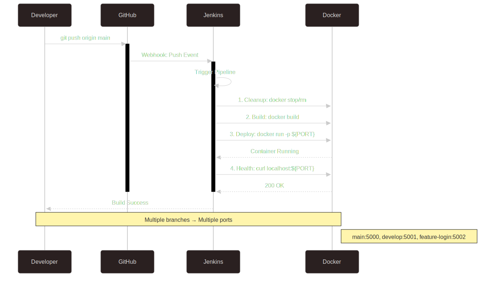

# Lab Documentation

## Overview

We have finally reached the last lab. We have mastered manual builds and multibranch pipelines. In this final lab, we are going to unlock **True Automation**. No more clicking "Build Now." By connecting GitHub to Jenkins using **Webhooks** and **Ngrok**, our pipeline will now wake up and deploy itself the instant we push code. We also add a **Native Docker Health Check** to ensure our app is truly alive, not just running.

## Prerequisites

- **All Lab 07 Prerequisites** (Docker, Jenkins, GitHub).
- **Ngrok Account** Free tier is fine and Ngrok installed on your machine.
- **Node.js** installed (for writing the health check script).
- A Jenkins Pipeline project already set up (reusing the specialized multibranch setup from Lab 07).

---

## 1. Webhook Automation Flow
In previous labs, we had to click "Build Now," like walking to the post office to check for mail. Now, we use Webhooks, which are like getting a push notification on your phone. The moment you push code to GitHub, it instantly notifies Jenkins to start working properly. This removes the manual delay and ensures your pipeline is always in sync with your latest work.



---

## 2. The Ngrok Tunnel

Your local machine is a fortress protected by firewalls. GitHub is outside and can't get in. **Ngrok** digs a secure tunnel that provides a public URL (e.g., `https://random-id.ngrok-free.app`). When GitHub sends a notification to this public address, Ngrok forwards it safely through the tunnel directly to your local Jenkins server on port 8080.



---

## 3. Branch Deployment Architecture

This architecture takes our Multibranch setup to the next level. We are deploying different branches to different ports (e.g., Main to 5000, Develop to 5001), but now it happens automatically via webhooks. Plus, we've added a **Health Check** inside each container. It's like having a dedicated security guard for each room who constantly checks if everything is okay inside, not just if the door is open.



## 4. Webhook Infrastructure

Instead of Jenkins constantly peeking out the window to see if updates have arrived (Polling), GitHub now walks up to the door and rings the bell (Webhook) whenever there is a new commit. But since our Jenkins is running locally, we need **Ngrok** to create a tunnel that lets GitHub find our house on the internet.



## 5. Health Check Architecture

Simply checking if a container is "Up" is not enough. The process might be running, but the app could be crashed or stuck. Our native health check runs a small script *inside* the container every 30 seconds. It tries to talk to the app on `localhost:5000`. If the app answers, the container is marked **Healthy**. If not, Docker marks it **Unhealthy**, alerting us to the problem immediately.



---

## 6. Lab Notes

[View Lab 08 Notes](NOTES.md)

---

## 7. Jenkins Lab Cheatsheet

[View Jenkins Lab Cheatsheet](JENKINS_LAB.md)

---

## 8. How to Setup Webhooks with Ngrok

### Step 1: Start Ngrok

1. Open a terminal on your host machine.
2. Run the command: `ngrok http 8080`.
3. Copy the `Forwarding` URL (e.g., `https://<YOUR_ID>.ngrok-free.app`).

### Step 2: Configure Jenkins

1. Go to **Manage Jenkins** > **System**.
2. Scroll to **GitHub** section.
3. Keep the settings default, but ensure **Hook URL** rules are understood (managed via plugin).

### Step 3: Configure GitHub

1. Go to your GitHub Repository > **Settings** > **Webhooks**.
2. Click **Add webhook**.
3. **Payload URL**: Paste your Ngrok URL + `/github-webhook/` (Essential!).
   - Example: `https://<YOUR_ID>.ngrok-free.app/github-webhook/`
4. **Content type**: Select `application/json`.
5. Click **Add webhook**.

### Step 4: Test It!

1. Make a small change to your unique `README.md` or any file.
2. `git add .`, `git commit`, and `git push`.
3. Watch your Jenkins Dashboard. The build should start **automatically** within seconds!

---

## 9. How to Verify Health Checks

After deployment, check your container status:

```bash
docker ps
```

You should see:

```text
STATUS
Up 2 minutes (healthy)
```

If it says `(starting)` or `(unhealthy)`, check the logs:

```bash
docker inspect --format='{{json .State.Health}}' <CONTAINER_ID>
```
